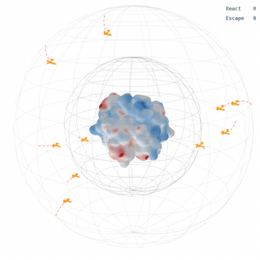

<div align="center">

<pre>
██████╗ ██╗   ██╗███████╗████████╗ █████╗ ██████╗  ██████╗
██╔══██╗╚██╗ ██╔╝██╔════╝╚══██╔══╝██╔══██╗██╔══██╗██╔════╝
██████╔╝ ╚████╔╝ ███████╗   ██║   ███████║██████╔╝██║     
██╔═══╝   ╚██╔╝  ╚════██║   ██║   ██╔══██║██╔══██╗██║     
██║        ██║   ███████║   ██║   ██║  ██║██║  ██║╚██████╗
╚═╝        ╚═╝   ╚══════╝   ╚═╝   ╚═╝  ╚═╝╚═╝  ╚═╝ ╚═════╝
</pre>

### Python Simulation Toolkit for Association Rate Constants

GPU-accelerated rigid body and flexible chain Brownian dynamics simulations for bimolecular association rate constants

<br>

[](https://github.com/anandojha/PySTARC/actions/workflows/ci.yml)
[](https://codecov.io/gh/anandojha/PySTARC)
[](https://www.codefactor.io/repository/github/anandojha/pystarc)

[](https://pypi.org/project/pystarc/)
[](https://pypi.org/project/pystarc/)
[](https://www.python.org/downloads/)
[](https://developer.nvidia.com/cuda-toolkit)

[](https://opensource.org/licenses/MIT)
[](https://github.com/psf/black)
[](https://github.com/anandojha/PySTARC/network/updates)
[](https://github.com/anandojha/PySTARC)

</div>

<div align="center">



</div>

---

## Overview

PySTARC computes the bimolecular association rate constants by implementing rigid body Brownian dynamics within the Northrup-Allison-McCammon formalism. Trajectories run in parallel on the GPU with a NumPy CPU fallback. 

## Installation

**GPU (Linux / HPC):**

```bash
git clone https://github.com/anandojha/PySTARC.git
cd PySTARC
bash install_PySTARC.sh
```

**Mac / CPU:**

```bash
git clone https://github.com/anandojha/PySTARC.git
cd PySTARC
conda create -n PySTARC python=3.11 -y
conda activate PySTARC
conda install -c conda-forge ambertools apbs rdkit openbabel -y
conda install -c openeye openeye-toolkits -y
pip install matplotlib pdb2pqr
pip install dist/pystarc-1.1.0-py3-none-any.whl --force-reinstall
```

## Testing

```bash
python -m pytest tests/
python -m pytest tests/ -v
```

## Quick start

```bash
conda activate PySTARC
module load cuda                # HPC only
cd examples/two_charged_spheres
bash run.sh
```

## Examples

See [`examples/`](examples/) for all example systems, each with its own README.

```
examples/
├── two_charged_spheres/              Analytical validation for the exact Smoluchowski solution
├── trypsin_benzamidine/              Protein-ligand complex
├── beta_cyclodextrin_guests/         Host-guest complex
├── thrombin_thrombomodulin/          Protein-protein complex
├── p38_mapk_sb203580/                Protein-ligand complex
├── carbonic_anhydrase_inhibitors/    Protein-ligand complexes
├── hsp90_inhibitors/                 Protein-ligand complexes
├── ttk_inhibitors/                   Protein-ligand complexes
└── barnase_barstar/                  Protein-protein complex
```

## Requirements

```
Python 3.11+
AmberTools
APBS
OpenBabel
RDKit
OpenEye Toolkits
NumPy
SciPy
Click
Numba
Matplotlib
pdb2pqr
CuPy
```

## License

MIT

## Citation

When using PySTARC, please cite:

> Ojha et al. PySTARC: GPU-accelerated Brownian dynamics for bimolecular association rate constants (2026).
